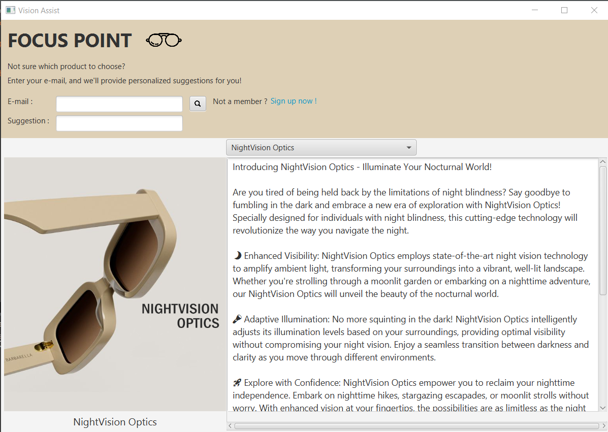
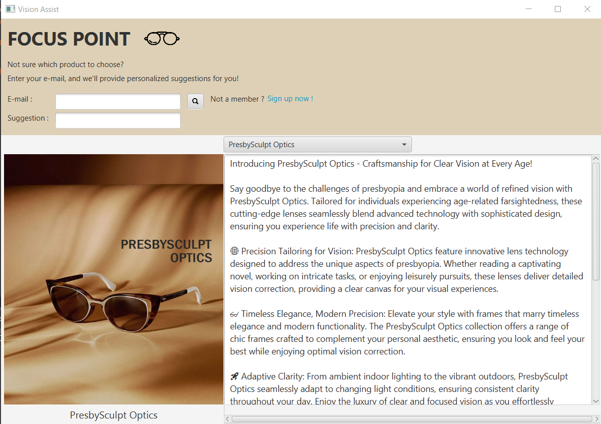
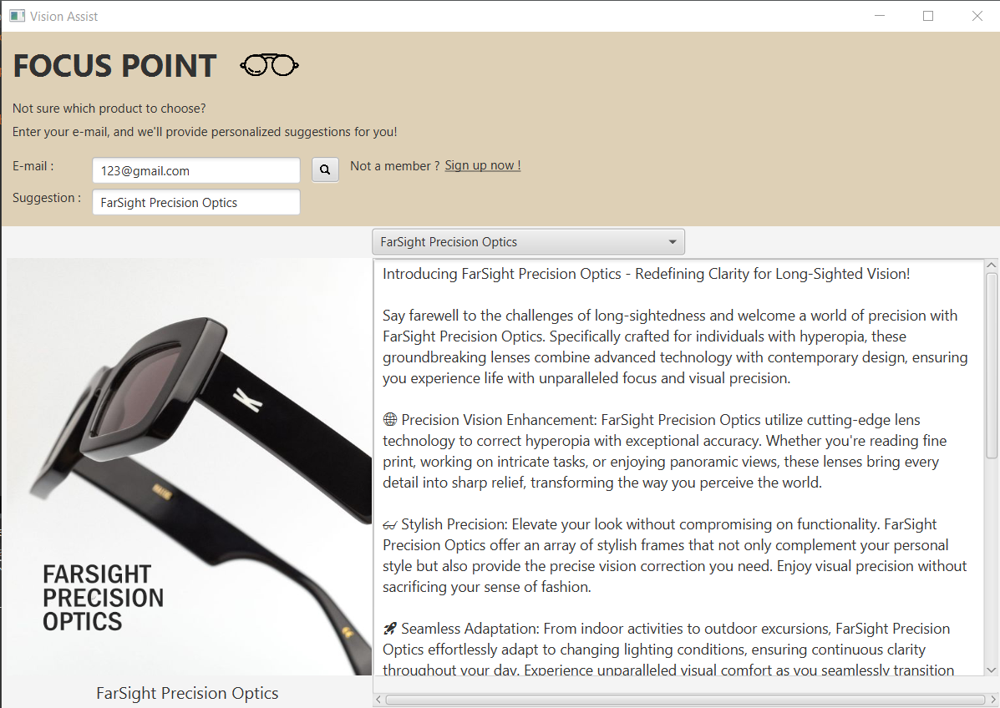

# 'Vision Assist' GUI using JavaFX

'Vision Assist' is an application that introduces different kinds of smart glasses specially crafted for people with vision impairment, such as night blindness, short-sightedness, long-sightedness, color blind and presbyopia. Upon signing up as a member, users receive personalized recommendations for smart glasses tailored to their specific vision needs, ensuring they find the most suitable eyewear for their condition.

HomePage of 'Vision Assist' GUI, introducing different types of glasses

Users are required to fill in email, optional to put name to sign up.

Upon signing up as a member, users can seek for personalized recommendation by filling in their email used and search for suggestion.
